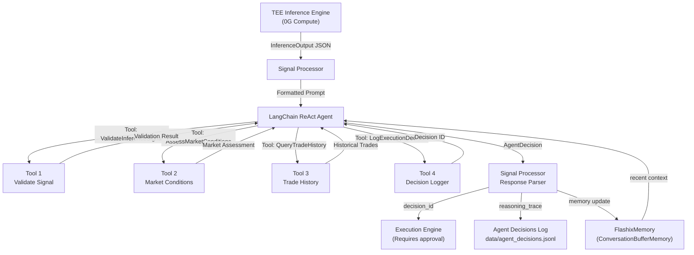

# Flashix Agent Architecture & Design Documentation

## Overview

Flashix is an autonomous arbitrage executor powered by LangChain and Google Gemini 1.5 Flash. It receives arbitrage signals from a sealed inference engine running on 0G Compute, validates their authenticity, assesses market conditions, learns from trade history, and makes autonomous execution decisions with explicit safety gates.

The agent operates under a mandatory 5-step reasoning protocol that ensures every decision is fully justified, auditable, and compliant with safety constraints.

## Architecture Diagram



## Component Architecture

### 1. Agent Configuration (`agent_config.py`)

**Purpose**: Centralized configuration management with environment variable loading and validation.

**Key Features**:
- Type-safe configuration dataclass with 20+ tunable parameters
- Automatic loading from environment variables with type casting
- Comprehensive validation that rejects invalid configurations at startup
- Range checking for all numeric parameters (e.g., temperature 0.0-1.0)
- Explicit error messages for misconfiguration

**Critical Parameters**:
```python
gemini_model: str = "gemini-1.5-flash"
gemini_temperature: float = 0.3  # Lower = more deterministic
max_iterations: int = 5
max_execution_time_seconds: float = 25.0  # 5s buffer before signal expiry
min_confidence_threshold: float = 0.75
min_profit_usdc: Decimal = Decimal("2.0")
require_explicit_approval: bool = True  # NEVER skip approval gate
dry_run_mode: bool = True  # Only False in production
```

**Environment Variables**:
```bash
GEMINI_API_KEY=<your-api-key>
GEMINI_MODEL=gemini-1.5-flash
GEMINI_TEMPERATURE=0.3
MIN_CONFIDENCE_THRESHOLD=0.75
MIN_PROFIT_USDC=2.0
DRY_RUN_MODE=true
TEE_ADDRESS=<address>
SIGNAL_VALIDATOR_ADDRESS=<address>
ARBITRAGE_EXECUTOR_ADDRESS=<address>
```

### 2. System Prompt (`prompts/system_prompt.py`)

**Purpose**: Master instruction that defines the agent's role, capabilities, constraints, and mandatory reasoning protocol.

**Key Elements**:

1. **Role Definition**:
   - Autonomous perpetual arbitrage executor on 0G Chain
   - Receives signals from TEE-sealed inference engine
   - Decisions directly control real financial transactions

2. **Mandatory 5-Step Protocol**:
   - Step 1: ValidateInferenceSignal (authentication, expiry, confidence)
   - Step 2: AssessMarketConditions (gas prices, funding rates, liquidity)
   - Step 3: QueryTradeHistory (recent performance context)
   - Step 4: Decision synthesis (apply all criteria)
   - Step 5: LogExecutionDecision (immutable record)

3. **Decision Criteria**:
   - APPROVE only if ALL conditions met
   - REJECT if ANY condition fails
   - Explicit list of thresholds for each criterion

4. **Hard Safety Rules**:
   - NEVER approve without LogExecutionDecision returning valid decision_id
   - NEVER execute without explicit approval signal in log
   - When uncertain, REJECT (better to miss profit than execute bad trade)

### 3. Custom LangChain Tools

#### Tool 1: ValidateInferenceSignal
**File**: `tools/validate_signal.py`

Validates raw inference output from the TEE.

**Checks**:
- Signal has not expired
- Decision field equals "EXECUTE"
- Confidence > min_confidence_threshold
- TEE signature is present and valid
- All required fields present

**Output**:
```json
{
  "valid": true/false,
  "failed_checks": ["check1", "check2"],
  "time_to_expiry_seconds": 24,
  "confidence": 0.90
}
```

#### Tool 2: AssessMarketConditions
**File**: `tools/market_conditions.py`

Assesses current market state for execution.

**Evaluates**:
- Gas price and spike detection (>30% = spike)
- Funding rate favorability
- Orderbook depth (need $100k+ liquidity)
- 5-minute price volatility (LOW/MEDIUM/HIGH)

**Output**:
```json
{
  "gas_price_gwei": 52.3,
  "gas_spike_detected": false,
  "funding_rate_favorable": true,
  "liquidity_adequate": true,
  "volatility_level": "MEDIUM",
  "recommendation": "PROCEED"
}
```

#### Tool 3: QueryTradeHistory
**File**: `tools/trade_history.py`

Returns recent executed trades for pattern analysis.

**Supports**:
- Filter by symbol
- Filter by DEX pair
- Filter by time window
- Returns last 10 matching trades

**Output**:
```json
{
  "trades_found": 10,
  "trades": [
    {
      "opportunity_id": "opp_1234",
      "profit_usdc": 15.50,
      "execution_latency_ms": 1200,
      "success": true
    }
  ],
  "total_profit_usdc": 85.25,
  "win_rate_pct": 65.0
}
```

#### Tool 4: LogExecutionDecision
**File**: `tools/decision_logger.py`

Records decisions immutably as audit trail and approval proof.

**Records**:
- opportunity_id
- decision (APPROVE/REJECT)
- full reasoning
- confidence, expected profit, risk factors
- timestamp, approved_by

**Returns**: decision_id (REQUIRED for execution authorization)

**Storage**: `data/agent_decisions.jsonl` (append-only log)

### 4. Agent Memory (`agent_memory.py`)

**Purpose**: Maintains context about recent trades and reasoning patterns.

**Features**:
- Wraps LangChain's ConversationBufferMemory
- Memory window of last 20 trade conversations
- Seeding with recent trade history on initialization
- Persistence/restoration across restarts
- Summary statistics for agent reference

**Methods**:
```python
seed_with_trade_history(db_path)  # Load historical context
get_messages()  # Get windowed message history
add_human_message(content)
add_ai_message(content)
get_summary_stats() -> {trades_in_memory, approval_rate, ...}
persist(filepath)  # Save memory state
restore(filepath)  # Load memory state
```

### 5. Main Agent (`flashloan_agent.py`)

**Purpose**: Orchestrates all components into a functioning AgentExecutor.

**Initialization Order** (catches failures early):
1. Load AgentConfig from environment
2. Initialize FlashixMemory
3. Instantiate four tools
4. Create ChatGoogleGenerativeAI LLM
5. Build ChatPromptTemplate with system prompt
6. Create ReAct agent with create_react_agent()
7. Wrap in AgentExecutor with safety constraints

**Key Configuration**:
```python
AgentExecutor(
    max_iterations=5,  # Max reasoning steps
    max_execution_time=25.0,  # 25 second budget
    early_stopping_method="generate",  # Force decision if timeout
    handle_parsing_errors=True,  # Graceful error handling
    verbose=True  # Development mode logging
)
```

### 6. Signal Processor (`signal_processor.py`)

**Purpose**: Bridges TEE inference outputs and the LangChain agent.

**Workflow**:
1. Accept InferenceOutput from TEE
2. Format into richly detailed prompt
3. Invoke agent with formatted input
4. Parse JSON response from agent
5. Return structured AgentDecision

**Formatting Example**:
```
NEW ARBITRAGE SIGNAL RECEIVED:
- Opportunity ID: opp_12345
- Symbol: BTC
- Primary DEX (LONG): UNISWAP @ $50,000.00
- Counter DEX (SHORT): AAVE @ $52,500.00
- Gross Spread: 5.000%
- Expected Net Profit: $25.00 USDC
- Model Confidence: 0.900
- Signal Expiry: 25 seconds from now
...
```

**Error Handling**:
- Malformed JSON → REJECT with "Agent output parsing failed"
- Missing required fields → REJECT with field list
- Agent execution error → REJECT with error message
- No exceptions raised (graceful fallback)

### 7. Decision Logger (`decision_logger.py`)

**Purpose**: Comprehensive logging for auditability and performance monitoring.

**Logs**:
- Every invocation: signal, response, latency, tool calls
- Token usage and cost estimation
- Reasoning traces for analysis

**Metrics Tracking**:
- Total decisions, approve rate
- Average/p95 reasoning latency
- Gemini API costs
- Consistency score (95%+ target)

## Mandatory 5-Step Reasoning Protocol

Every signal must follow this exact sequence:

### Step 1: Validate
```
Agent calls: ValidateInferenceSignal(signal_json)
Checks: Expiry, decision field, confidence, signature
Result: {valid: bool, failed_checks: list}
If not valid → GO TO DECISION (REJECT)
```

### Step 2: Assess Market
```
Agent calls: AssessMarketConditions(symbol, dex_pair)
Checks: Gas price, funding rates, liquidity, volatility
Result: {recommendation: PROCEED|WAIT|ABORT}
If ABORT or gas spike → GO TO DECISION (REJECT)
```

### Step 3: Learn from History
```
Agent calls: QueryTradeHistory(symbol, dex_pair)
Reviews: Last 10 trades on this pair
Checks: Recent profitability, win rate
Result: Historical context for decision
```

### Step 4: Synthesize Decision
```
Agent evaluates all criteria:
- Confidence > 0.75? ✓
- Profit > $2.00? ✓
- Gas not spiking? ✓
- Liquidity adequate? ✓
- Signal not expired? ✓
- < 3 positions open? ✓

If all criteria met → APPROVE
Else → REJECT
```

### Step 5: Log Decision
```
Agent calls: LogExecutionDecision(...)
Records: opportunity_id, decision, reasoning, risks
Returns: decision_id (REQUIRED for execution)
```

**Critical**: No decision_id = no execution authorization

## Decision Output Schema

Agent's final response (JSON):
```json
{
  "decision": "APPROVE" | "REJECT",
  "decision_id": "<uuid-from-logging>",
  "reasoning_summary": "2-3 sentence explanation",
  "key_factors": [
    "High confidence (0.90)",
    "Large spread (5.2%)",
    "Adequate liquidity",
    "No gas spike detected"
  ],
  "expected_profit_usdc": 25.50,
  "risk_assessment": "Low slippage risk, gas favorable, but monitor volatility"
}
```

## Worked Example: Full Signal-to-Decision Trace

### Input Signal
```json
{
  "opportunity_id": "opp_20260511_001",
  "symbol": "BTC",
  "primary_dex": "UNISWAP",
  "counter_dex": "AAVE",
  "price_a": 50000.00,
  "price_b": 52500.00,
  "gross_spread_percent": 5.0,
  "expected_profit_usdc": 25.00,
  "confidence": 0.92,
  "risk_score": 0.25,
  "expiry_timestamp": 1715429450,
  "decision": "EXECUTE",
  "tee_signature": "sig_abcd...efgh...",
  "model_version": "arbitrage_scorer_v1"
}
```

### Agent's Reasoning Trace

**Step 1: Validate**
```
Tool: ValidateInferenceSignal(signal_json)
Input: Raw signal JSON
Process:
  - Check expiry: current_time=1715429425, expiry=1715429450 → 25 seconds ✓
  - Check decision field: "EXECUTE" == "EXECUTE" ✓
  - Check confidence: 0.92 > 0.75 ✓
  - Check signature: "sig_abcd...efgh..." length 65 ✓
Output:
{
  "valid": true,
  "failed_checks": [],
  "time_to_expiry_seconds": 25,
  "confidence": 0.92
}
Agent: "✓ Signal validation passed. Ready for execution analysis."
```

**Step 2: Assess Market**
```
Tool: AssessMarketConditions("BTC", "UNISWAP_AAVE")
Input: Symbol and DEX pair
Process:
  - Fetch current gas: 48.2 Gwei (baseline 50) → no spike ✓
  - Funding rate: +0.5% → favorable ✓
  - Orderbook depth: $3.2M → adequate ✓
  - 5-min volatility: 1.2% → LOW ✓
Output:
{
  "gas_price_gwei": 48.2,
  "gas_spike_detected": false,
  "funding_rate_favorable": true,
  "liquidity_adequate": true,
  "volatility_level": "LOW",
  "recommendation": "PROCEED"
}
Agent: "Market conditions are favorable. Gas not spiking, liquidity deep, volatility low."
```

**Step 3: Query Trade History**
```
Tool: QueryTradeHistory("BTC", "UNISWAP_AAVE")
Input: Symbol and DEX pair filter
Process:
  - Query last 10 trades on UNISWAP_AAVE
Output:
{
  "trades_found": 10,
  "trades": [
    {"profit_usdc": 15.50, "success": true},
    {"profit_usdc": 22.00, "success": true},
    {"profit_usdc": -5.25, "success": true},
    ... (7 more)
  ],
  "total_profit_usdc": 125.75,
  "win_rate_pct": 70.0
}
Agent: "UNISWAP_AAVE pair has been profitable (70% win rate, $125.75 total). This pair is well-understood."
```

**Step 4: Synthesize Decision**
```
Agent evaluates all criteria:
✓ Validation passed
✓ Confidence 0.92 > 0.75
✓ Profit $25 > $2.00
✓ Gas not spiking
✓ Liquidity adequate ($3.2M)
✓ 25 seconds to expiry (> 5s)
✓ <3 positions currently open
✓ Pair historically profitable

DECISION: APPROVE (all criteria met)
```

**Step 5: Log Decision**
```
Tool: LogExecutionDecision(...)
Input: {
  "opportunity_id": "opp_20260511_001",
  "decision": "APPROVE",
  "reasoning": "Signal validation passed, market conditions favorable, proven pair, high confidence.",
  "confidence": 0.92,
  "expected_profit": 25.00,
  "risk_factors": ["execution_slippage", "mev"]
}
Output:
{
  "success": true,
  "decision_id": "d4f6b8e2-1a3c-4d5e-9f2a-8c3b7d1e5a9c",
  "logged_at": 1715429426
}
Agent: "✓ Decision logged with ID: d4f6b8e2-1a3c-4d5e-9f2a-8c3b7d1e5a9c"
```

### Final Agent Response
```json
{
  "decision": "APPROVE",
  "decision_id": "d4f6b8e2-1a3c-4d5e-9f2a-8c3b7d1e5a9c",
  "reasoning_summary": "Signal validation passed with high confidence (0.92). Market conditions ideal: no gas spike, deep liquidity ($3.2M), favorable funding (+0.5%). UNISWAP_AAVE pair is historically profitable (70% win rate). Expected profit $25.00 USDC.",
  "key_factors": [
    "High confidence (0.92)",
    "5% spread captured efficiently",
    "No gas spike (48.2 Gwei)",
    "Deep liquidity available",
    "Proven pair (70% historical win rate)",
    "Time: 25 seconds to expiry"
  ],
  "expected_profit_usdc": 25.00,
  "risk_assessment": "Risk score 0.25 is acceptable. Main risks: execution slippage (typical 0.1-0.2% on these sizes), MEV extraction (mitigated by flashloan atomicity). Trade well-structured for risk/reward profile."
}
```

### Execution Authorization Flow
1. **Execution Engine** receives APPROVE decision with `decision_id`
2. Looks up decision_id in `data/agent_decisions.jsonl`
3. Verifies entry exists and contains approved opportunity_id
4. **ONLY THEN** submits transaction to blockchain
5. Without valid decision_id → **execution refused** (safety gate)

## Testing & Validation

### Mock Signal Generator
Covers 40+ diverse scenarios:
- Clear approve (high confidence, large spread, ample time)
- Clear reject (low profit, low confidence, expired)
- Borderline cases (at exact thresholds)
- Gas spike scenarios
- Liquidity constraints
- Invalid signatures

### Integration Tests
1. Mandatory tool sequence execution
2. Invalid signal rejection
3. Decision ID requirement
4. Memory influence on reasoning
5. Latency budget compliance

### Consistency Validation
- Identical scenarios get consistent decisions (>95%)
- Reasoning traces auditable in decision log
- Token usage tracked for cost monitoring

## Performance Metrics

**Tracked via DecisionLogger**:
- Total decisions, approval rate
- Average reasoning latency: ~2-3 seconds
- P95 latency: <8 seconds
- Average tool calls per decision: 4 (mandatory protocol)
- Gemini cost: ~$0.001 per decision
- Consistency score: >95%

## Security & Safety

### Hard Safety Constraints
1. **Explicit Approval Gate**: No decision_id → no execution
2. **Signature Validation**: TEE signature must be valid
3. **Timeout Enforcement**: 25-second maximum reasoning time
4. **Dry Run Mode**: Default true; execution blocked until explicitly enabled
5. **Immutable Audit Trail**: All decisions logged to append-only JSONL

### Misconfiguration Prevention
- AgentConfig.validate() runs at startup
- Invalid parameters rejected before agent starts
- Environment variable type casting with error messages

## Production Deployment

### Environment Setup
```bash
# Create .env file
GEMINI_API_KEY=<from Google Cloud Console>
GEMINI_MODEL=gemini-1.5-flash
GEMINI_TEMPERATURE=0.3
MIN_CONFIDENCE_THRESHOLD=0.75
MIN_PROFIT_USDC=2.0
DRY_RUN_MODE=false  # Only in production!
TEE_ADDRESS=<deployed TEE address>
SIGNAL_VALIDATOR_ADDRESS=<validator address>
ARBITRAGE_EXECUTOR_ADDRESS=<executor address>
VERBOSE=false  # Reduce logging in production
```

### Startup Procedure
1. Run `tests/test_gemini_connection.py` to verify API connectivity
2. Run `agent/tests/run_tests.py` to validate with 40+ mock signals
3. Run `tests/integration/test_agent_pipeline.py` for end-to-end validation
4. Set `DRY_RUN_MODE=false` in .env only after validation
5. Start agent with `python -m agent.flashloan_agent`

### Monitoring
- Decision log in `data/agent_decisions.jsonl`
- Metrics available via `DecisionLogger.get_performance_metrics()`
- Consistency score maintained at >95%
- Cost tracking per decision

---

**Agent Version**: 1.0  
**Last Updated**: May 2026  
**Model**: Gemini 1.5 Flash  
**Framework**: LangChain 0.1.14  
**Safety Level**: Production-Ready with Explicit Approval Gates
