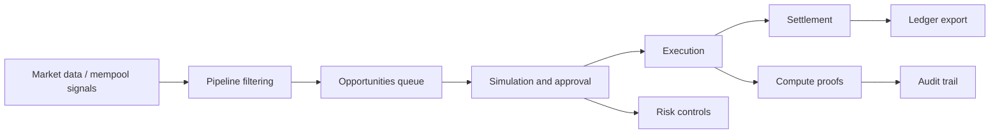

# System Architecture

Flashix is organized as a deterministic trading pipeline with a React control plane, a consolidated FastAPI backend, TEE-assisted compute evidence, and an on-chain settlement layer.

## System Overview

The application is designed around one core principle: every major trade decision should be explainable, reproducible, and auditable.

The user-facing stack is split into a few clear layers:

1. The frontend renders the operator workflow.
2. The backend consolidates market, trace, metrics, pipeline, and settlement APIs.
3. The compute layer produces signed proofs and validation records.
4. The execution layer handles simulation, broadcast, and settlement.
5. The demo persistence service stores exports and audit artifacts.

## High-Level Flow

## Frontend

The frontend lives in `frontend/src/` and uses React Router to expose the operator workflow.

### Routes

- `/` -> Dashboard
- `/pipeline` and `/pipeline/:stage` -> Pipeline view
- `/opportunities` -> opportunities queue
- `/opportunity/:id` -> opportunity detail
- `/risk` -> risk center
- `/execution` -> execution center
- `/settlement` -> settlement and portfolio view
- `/market-data` -> market data health screen
- `/compute` -> compute and TEE proof screen

### Page Responsibilities

#### Dashboard

The dashboard surfaces the current system state and provides the quickest path into the rest of the app. It also exposes the demo launch controls that seed a deterministic scenario.

#### Pipeline

The pipeline view shows how a candidate moves from raw input to an actionable item. It is the best place to inspect stage progression and the seeded demo item.

#### Opportunities

This queue is the operator decision surface. Each row contains expected profit, risk, freshness, status, simulation state, and actions for simulate, approve, reject, or trace.

#### Risk

The risk center aggregates circuit breakers, portfolio limits, live positions, and human override records. It is intentionally conservative: when a breaker is triggered, the UI makes the pause obvious.

#### Execution

Execution is the safety gate. It records pre-flight simulation, gas estimates, broadcast progress, transaction hashes, and proof links to deployed contracts.

#### Settlement

Settlement closes the loop. It shows realized and unrealized PnL, repayment obligations, open positions, and persisted exports.

#### Market Data

Market Data explains whether the current feed is fresh and trustworthy enough to support execution. It shows source freshness, fallback reliability, and persisted snapshots.

#### Compute

Compute ties the pipeline to the TEE artifacts. It displays request histories, validation results, signatures, and trace links.

## Agent Architecture

The agent side of Flashix is a second control plane that reasons about opportunities before they reach execution.

The agent architecture centers on these components:

- Configuration loading and validation from environment variables.
- A mandatory reasoning protocol that validates the signal before evaluation.
- Custom tools for signal validation, market condition checks, history queries, and decision logging.
- Memory that preserves recent trade context and approval patterns.
- A LangChain executor that wraps the model, tools, and safety constraints.
- A signal processor that converts TEE output into a structured prompt and parses the response.
- An append-only decision logger that records the approval trail.

This design matters because the agent is not just an LLM wrapper. It is an explicit decision system with gates, logs, and stateful context.

### Agent Workflow

The agent flow follows a strict order:

1. Validate the incoming inference signal.
2. Check current market conditions.
3. Query recent trade history for pattern matching.
4. Log the execution decision before any trade is authorized.
5. Preserve the decision in memory for future comparisons.

If any step fails, the system rejects the opportunity rather than forcing execution.

## Market Data And Mempool Pipeline

Flashix depends on a live data pipeline that turns market activity into candidate opportunities.

The main pipeline layers are:

- Mempool ingestion from private relay providers.
- Price feed aggregation across DEX and oracle sources.
- Opportunity detection from spread and funding signals.
- Cost filtering to ensure trades stay profitable after fees.
- Queue emission into the compute and execution workflow.

The mempool side is designed to be mode-aware:

- Live mode connects to external providers.
- Simulation mode emits deterministic synthetic opportunities for development and testing.

The market data side is freshness-aware:

- Source health and freshness thresholds determine whether the system is safe to use.
- Fallback logic protects the execution path when one source degrades.
- Stale data is treated as a reason to pause or reduce risk.

## Backend

The backend entry point is `agent/backend_app.py`.

It exposes a single FastAPI application that mounts the following router groups:

- market data API
- reasoning trace API
- metrics dashboard API
- settlement ledger API
- pipeline trace API

The root endpoint returns a small health payload, and `/health` is available for quick checks.

## State and Data Flow

The app keeps most operational state in the frontend store, with the backend used for API consolidation and persistence-oriented services.

The general sequence is:

1. Market and pipeline data are ingested or generated.
2. The frontend displays the queue and operational state.
3. Operators run simulation or approval actions.
4. Execution records transaction hashes and proof references.
5. Settlement generates a final portfolio view and export artifact.
6. Risk and compute views preserve the audit trail.

## Compute and Proofs

The compute directory contains the TEE-related logic used to produce deterministic proof artifacts.

The UI shows the resulting signature, trace, and validation data so a reviewer can check whether a request was processed correctly.

Important ideas:

- Validation should happen before broadcast.
- Proof artifacts should be linked to the original pipeline request.
- Signatures and traces should be visible to the operator after the fact.
- The execution engine should never bypass the approval gate.
- Settlement should emit a durable ledger record and postmortem when a trade fails.

## Monitoring And Runbooks

Operational visibility is part of the architecture, not an afterthought.

The system tracks:

- Execution success rate.
- Mempool-to-decision latency.
- Decision-to-settlement latency.
- Profit per trade.
- Oracle freshness.
- Queue depth.
- Circuit breaker state.
- Daily PnL and drawdown.

When those metrics drift, the operator flow should shift from execution to investigation. The docs set includes dedicated references for monitoring, risk management, settlement monitoring, and production runbooks.

## Execution and Settlement

Execution and settlement are intentionally separated because they answer different questions.

- Execution asks: should the trade be broadcast, and if so, did it broadcast successfully?
- Settlement asks: what did the trade earn, what remains open, and what evidence should be exported?

This split makes the UI easier to reason about and reduces the risk of mixing pre-trade and post-trade concerns.

## Persistence Layer

The demo persistence service keeps exported artifacts, override records, and replayable evidence available after the session ends.

That persistence layer is important because the demo is intended to be reviewable, not just executable.

## Related Operational Docs

- [docs/MEMPOOL_ARCHITECTURE.md](MEMPOOL_ARCHITECTURE.md)
- [docs/MARKET_DATA.md](MARKET_DATA.md)
- [docs/AGENT_ARCHITECTURE.md](AGENT_ARCHITECTURE.md)
- [docs/EXECUTION_ENGINE.md](EXECUTION_ENGINE.md)
- [docs/RISK_MANAGEMENT.md](RISK_MANAGEMENT.md)
- [docs/SETTLEMENT_MONITOR.md](SETTLEMENT_MONITOR.md)
- [docs/MONITORING.md](MONITORING.md)
- [docs/PRODUCTION_RUNBOOK.md](PRODUCTION_RUNBOOK.md)

## Deployment Surface

The project can be run locally or through the deployed frontend at [https://flashix-mu.vercel.app/](https://flashix-mu.vercel.app/).

The deployed UI is the easiest way to review the architecture visually. Local execution is better when you need to inspect logs, validate changes, or run the supporting services yourself.

## Operational Principles

1. Prefer deterministic demo state when presenting the app.
2. Keep simulation ahead of broadcast.
3. Make risk and settlement visible, not hidden.
4. Preserve proof artifacts for later review.
5. Treat the dashboard as a control plane, not just a landing page.

## Where to Read Next

- [Setup.md](Setup.md) for local environment preparation.
- [Demo.md](Demo.md) for the guided walkthrough.
- [Tests.md](Tests.md) for validation and verification.
- [README.md](../README.md) for the project overview and live demo link.
