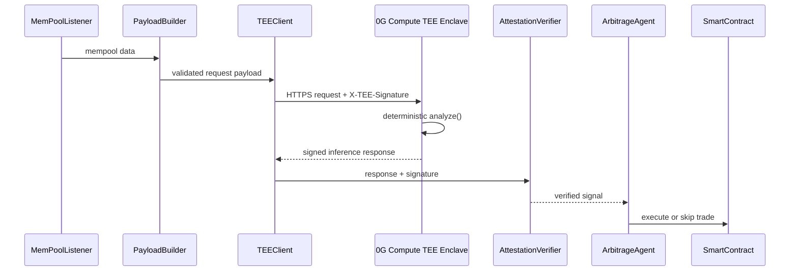

# Flashix Compute Integration (TEE)

This document describes the sealed inference layer used by Flashix for arbitrage decisions. The repository supports two execution modes:

1. `local` TEE simulation for offline development.
2. `0g-compute` live provider routing for signed remote inference.

## TEE Trust Chain

## Why TEE Matters

Without sealed inference, raw mempool data and trading signals are visible to the compute provider and can be replayed or front-run. With TEE-backed inference, the provider proves that the exact code ran on the exact data while keeping the plaintext inputs and outputs inside the sealed boundary.

## Configuration Reference

| Variable | Description | Valid Values | Default |
| --- | --- | --- | --- |
| `TEE_MODE` | Selects the execution backend | `local`, `0g-compute` | `local` |
| `TEE_ENDPOINT` | HTTPS endpoint for live 0G Compute inference | Provider URL from the portal | Required in live mode |
| `TEE_API_KEY` | API key used for authentication and HMAC signing | Secret string from the portal or sandbox | Required in live mode |
| `TEE_ATTESTATION_CERT_PATH` | Pinned attestation certificate path | Absolute or repo-relative file path | `./certs/tee-attestation.pem` |
| `TEE_REQUEST_TIMEOUT_MS` | Request timeout for live inference calls | Integer milliseconds | `5000` |
| `TEE_SIGNATURE_VALIDATION` | Enables response validation before the agent consumes output | `true`, `false` | `true` |
| `TEE_LOCAL_SIGNING_PRIVATE_KEY` | Deterministic dev key for local signature generation | Hex ECDSA private key | Local fallback key |
| `TEE_SIGNER_ADDRESS` | Expected signer address for live verification | Hex EVM address | Derived from the local fallback key |

## Security Guarantees

- Determinism: the analyzer seeds its random number generators, hashes canonical response fields, and signs the same output for the same input.
- Zero egress: the enclave path does not open outbound connections; the host handles transport and validation.
- Signature integrity: every response is validated against the recovered signer before the agent executes a trade.
- Input sanitation: payloads are rejected before they enter the enclave if they do not match the strict schema.

## Operational Runbook

1. Switch from local to live 0G Compute by setting `TEE_MODE=0g-compute` and filling `TEE_ENDPOINT`, `TEE_API_KEY`, and `TEE_ATTESTATION_CERT_PATH`.
2. Rotate the TEE API key by provisioning a new key in the portal, updating your secret store, confirming live requests succeed, and then revoking the old key.
3. If a `COMPUTE_UNAVAILABLE` alert fires, pause new opportunity processing, keep the current position state, and notify the ops webhook before retrying.
4. If the provider rotates the attestation certificate, replace the pinned cert, refresh the verifier, and run a signature check against a known-good response before resuming execution.
5. If p95 latency moves into `DEGRADED`, increase the minimum profit threshold by 1 percent and keep monitoring until it returns to `HEALTHY`.

## Known Limitations

- Local Open Enclave simulation does not provide hardware-backed attestation; it is development-only.
- Attestation quote verification still depends on upstream IAS or provider services being reachable.
- Model quality depends on the training data used to produce the scorer artifact, which is not independently audited.
