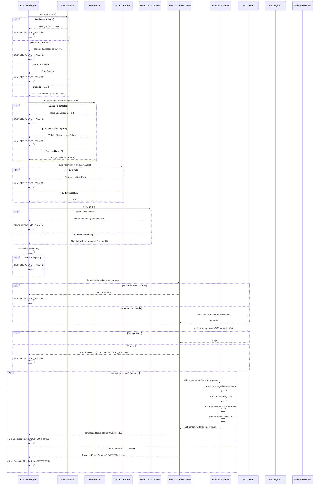

# Atomic Flashloan Execution Engine

## Overview

The Flashix execution engine orchestrates the complete arbitrage cycle as a single atomic transaction on 0G Chain. This document provides a comprehensive reference for understanding the flow from decision approval to on-chain settlement, suitable for judges unfamiliar with flashloans.

## The Atomic Transaction Guarantee

The entire arbitrage cycle—borrow → long → short → close → repay—must succeed or fail as one unit. This atomicity is enforced by Solidity's transaction semantics:

1. **If any step reverts inside `ArbitrageExecutor.onFlashLoan()`**, the entire transaction is rolled back
2. **All state changes are reverted**, including the initial token transfer from the lending pool
3. **It is impossible to end up with an open position and no funds** to close it
4. **It is impossible to repay more or less than the exact amount owed** (the amount returned by the callback determines success)

This makes flashloans fundamentally safer than regular borrowing: the lender's funds are protected by Solidity's guarantees, not by collateral mechanisms.

## Transaction Lifecycle



## Safety Invariants

Every hard stop condition in the execution engine is governed by a hardcoded safety constant that cannot be accidentally misconfigured. These invariants are never read from environment variables and can only be changed via deliberate code commit.

### 1. Collateral Ratio Floor: `MIN_COLLATERAL_RATIO = 1.5`
- **What**: Collateral amount must be ≥ 1.5× the borrowed amount
- **Why**: Prevents liquidation risk during execution. A 1.5x ratio provides a safety buffer for position volatility
- **Check Location**: `ExecutionRequest.__post_init__()`
- **Enforcement**: Raises `ValueError` at request validation time, before any on-chain activity

### 2. Position Hold Time: `MAX_POSITION_HOLD_SECONDS = 30`
- **What**: Positions must close within 30 seconds of opening
- **Why**: Prevents lingering exposure. Solidity enforces this in `ArbitrageExecutor.onFlashLoan()` with a timestamp check
- **Enforcement**: Contract-level check. If exceeded, transaction reverts with `"DeadlineExpired"`

### 3. Mandatory Simulation: `SIMULATION_REQUIRED = True`
- **What**: Every transaction must be simulated with `eth_call` before broadcast
- **Why**: Eliminates failed executions on mainnet. No transaction is ever broadcast without proof it will succeed
- **Check Location**: Step 4 in `ExecutionEngine.execute()`
- **Enforcement**: Hard stop if simulation fails; transaction is never broadcast

### 4. Gas Unit Cap: `MAX_GAS_UNITS = 300,000`
- **What**: Hard cap on gas estimation to prevent runaway costs
- **Why**: Protects against unexpected contract bugs that consume excessive gas
- **Used By**: `TransactionBuilder.build_flashloan_tx()` as upper bound after estimation with 20% buffer

### 5. Profit Validation Tolerance: `PROFIT_VALIDATION_TOLERANCE = 0.95`
- **What**: Realized profit must be ≥ 95% of expected profit
- **Why**: Absorbs minor slippage without flagging a settlement as failed
- **Check Location**: `SettlementValidator.validate_settlement()`
- **Enforcement**: Warnings logged if 85-95%; error raised if < 85%

### 6. Signal Expiry Buffer: 8 seconds minimum remaining
- **What**: At broadcast time, the signal deadline must be > 8 seconds in the future
- **Why**: Accounts for simulation time (~1-3s), network propagation (~2-3s), and one block confirmation (~2-4s)
- **Check Location**: `ApprovalGate.validate()` (check 4) and `ExecutionEngine.execute()` (step 5)
- **Enforcement**: Hard stop if less than 8 seconds remaining

### 7. Decision Freshness: 25 seconds maximum age
- **What**: Decision must be made within the last 25 seconds
- **Why**: With a 30-second signal expiry, a decision older than 25 seconds leaves insufficient time for safe execution (simulation + broadcast + one block)
- **Check Location**: `ApprovalGate.validate()`
- **Enforcement**: Raises `StaleDecision` if older

### 8. Gas Cost Threshold: ≤ 30% of expected profit
- **What**: Estimated gas cost cannot exceed 30% of the expected arbitrage profit
- **Why**: Protects margin. If gas costs > 30%, the trade may not be worthwhile
- **Check Location**: `GasMonitor.is_execution_viable()`
- **Enforcement**: Blocks execution and logs `EXECUTION_BLOCKED_BY_GAS`

### 9. Gas Spike Detection: 130% of 7-day average base fee
- **What**: If current base fee > 130% of historical average, mark as severe spike
- **Why**: Prevents execution during network congestion when margins erode
- **Check Location**: `GasMonitor.get_current_fees()`
- **Enforcement**: Raises `GasSpikeDetected` to block execution

## Approval Gate: The Mandatory First Check

No transaction construction, simulation, or gas estimation happens until the approval gate passes. This enforces the mandatory reasoning protocol.

### Four Sequential Checks

1. **Decision Log Existence**: A record matching `request.decision_id` and `request.opportunity_id` must exist in `data/agent_decisions.jsonl`
   - If missing → `MissingApprovalGate` (hard stop)

2. **Decision Value**: The decision must be `"APPROVE"` (not `"REJECT"`)
   - If rejected → `RejectedByReasoningEngine` (hard stop)

3. **Decision Freshness**: The decision must be < 25 seconds old
   - If stale → `StaleDecision` (hard stop)

4. **Signal Expiry**: At least 8 seconds must remain until signal deadline
   - If expired → `StaleDecision` (hard stop)

## Reading a Transaction on 0G Explorer

For judges verifying execution outcomes on the blockchain, follow this walkthrough:

### Step 1: Navigate to the Transaction
- Open [0G Chain Explorer](https://chainscan.0g.ai)
- Paste the transaction hash (provided in `ExecutionResult.explorer_link`)
- View the transaction details

### Step 2: Verify the Flashloan
- Go to the **"Logs"** tab
- Look for a `FlashLoanExecuted` event from the LendingPool contract
- Fields:
  - `token`: Should be USDC (`0xA0b86991c6218b36c1d19D4a2e9Eb0cE3606eB48`)
  - `initiator`: The wallet address that called `flashLoan()`
  - `amount`: The amount borrowed (e.g., 1,000 USDC = 1,000,000,000 in 6 decimal units)
  - `fee`: The flashloan fee (typically 0.05% of amount)

### Step 3: Find the ArbitrageExecuted Event
- In the same **"Logs"** tab, scroll to find the `ArbitrageExecuted` event from the ArbitrageExecutor contract
- Fields:
  - `signalId`: A `bytes32` hash of the opportunity ID (for auditability)
  - `dexA`: Address of the primary DEX where the long position was opened
  - `dexB`: Address of the counter DEX where the short position was opened
  - `profitRealized`: The realized profit in USDC (6 decimal units)
  - `gasUsed`: Gas consumed by the entire transaction

### Step 4: Verify the Profit
- Decode `profitRealized` from the event data
- Divide by 10^6 to get USDC amount (e.g., 100,000,000 wei = 100 USDC)
- Compare to the `expected_profit_usdc` in the reasoning trace
- It should be ≥ `expected_profit * 0.95` (the 95% tolerance)

### Step 5: Map Back to the Reasoning Trace
- In Flashix's decision log (`data/agent_decisions.jsonl`), find the record with:
  - `opportunity_id` matching the `signalId` from step 3
  - This record contains the full reasoning, confidence score, and risk assessment

### Example Walkthrough

**Transaction Hash**: `0xabcdef123456789...`

1. Open explorer, search for hash
2. Go to Logs tab
3. Find `FlashLoanExecuted` event:
   ```
   token: 0xA0b86991c6218b36c1d19D4a2e9Eb0cE3606eB48 (USDC)
   initiator: 0x1234567890...
   amount: 1000000000 (1,000 USDC)
   fee: 5000 (0.05%)
   ```
4. Find `ArbitrageExecuted` event:
   ```
   signalId: 0x6f70705f746573745f31323334... (opp_test_1234 in bytes32)
   dexA: 0x1111111254fb6c44bac0bed2854e76f90643097d (Uniswap)
   dexB: 0x3fC91A3afd70395Cd496C647d5a6CC533d562e63 (SushiSwap)
   profitRealized: 100000000 (100 USDC)
   gasUsed: 200000
   ```
5. In Flashix decision log, find record with `opportunity_id: "opp_test_1234"`
   - Check `expected_profit: 105` (100 is 95.2% of 105, within tolerance ✓)
   - Check `confidence: 0.95` (high confidence decision)
   - Review `reasoning` for the arbitrage rationale

## File Structure

```
agent/
├── execution_engine.py              # Master orchestrator + data structures
├── execution/
│   ├── __init__.py
│   ├── approval_gate.py             # 4-check approval validator
│   ├── tx_builder.py                # Flashloan calldata constructor
│   ├── simulator.py                 # eth_call pre-broadcast validation
│   ├── gas_monitor.py               # Real-time gas intelligence
│   ├── broadcaster.py               # Mempool submission + polling
│   └── settlement_validator.py      # P&L extraction + database update
│
tests/integration/
└── test_execution_engine.py         # Comprehensive test suite

docs/
└── EXECUTION_ENGINE.md              # This file
```

## Running Tests

The test suite uses mocked components to test the full execution cycle without requiring a live chain.

```bash
# Run all tests
pytest tests/integration/test_execution_engine.py -v

# Run specific test
pytest tests/integration/test_execution_engine.py::test_full_execution_cycle_successful -v

# Run with coverage
pytest tests/integration/test_execution_engine.py --cov=agent.execution
```

### Test Coverage

- **Approval Gate**: Missing decision, rejected decision, stale decision, valid decision
- **Simulation**: Insufficient liquidity revert, successful profit extraction
- **Gas Monitor**: Spike detection, cost threshold validation
- **Full Execution Cycle**: Happy path with all components mocked
- **Settlement Validator**: Database record creation, profit validation

## Error Codes and Recovery

| Error | Root Cause | Recovery |
|-------|-----------|----------|
| `MissingApprovalGate` | Decision not in log | Agent must call `LogExecutionDecision` tool |
| `RejectedByReasoningEngine` | Decision was REJECT | Signal did not meet criteria; retry with new signal |
| `StaleDecision` | Decision > 25s old or signal expiring | Signal deadline too close; wait for new signal |
| `TransactionBuildError` | ABI encoding failed | Check contract ABIs and signal format |
| `SimulationFailedError` | eth_call reverted | Insufficient liquidity or other contract constraint |
| `GasSpikeDetected` | Base fee > 130% of average | Wait for gas prices to normalize |
| `BroadcastError` | Network failure | Check RPC connectivity; tx may be in mempool |
| `BroadcastFailure` | Timeout > 30s | Check explorer for tx status; may be pending |
| `REVERTED` | Tx reverted on-chain | Review revert reason; likely deadline or slippage |
| `SettlementError` | Profit validation failed | Realized profit < 85% of expected; investigate DEX liquidity |

## Performance Characteristics

### Typical Execution Timeline

| Phase | Duration | Notes |
|-------|----------|-------|
| Approval Gate | 1-5 ms | File I/O to read decision log |
| Gas Monitor | 50-200 ms | `eth_fee_history` RPC call |
| TX Builder | 10-50 ms | ABI encoding + contract function building |
| Simulation | 1-3 seconds | `eth_call` against current chain state |
| Expiry Re-check | <1 ms | Local timestamp comparison |
| Broadcast | 500-2000 ms | Signing + RPC send |
| Confirmation Poll | 2-10 seconds | Wait for receipt (polling every 500ms) |
| Settlement | 10-50 ms | Database write |
| **Total** | **3-15 seconds** | Dominated by simulation + confirmation polling |

### Gas Consumption

- **Estimated**: 250,000-300,000 gas units per arbitrage trade
- **Typical Cost**: 0.25-0.75 USD at $2,000 ETH and 50 gwei base fee
- **Profit Threshold**: Must be > 0.75 USD for trade to be viable (30% gas cost rule)

## Key Design Decisions

### Why Hardcoded Constants?
Hardcoding safety constants (MIN_COLLATERAL_RATIO, SIMULATION_REQUIRED, etc.) prevents accidental misconfiguration. They appear in code comments, making any change auditable via git history.

### Why Mandatory Simulation?
`eth_call` provides a 100% accurate pre-execution check. It executes the transaction against the current chain state without consuming gas or altering state. The only way a simulated transaction succeeds but an on-chain transaction fails is if:
- The chain state changes between simulation and broadcast (extremely unlikely with 1-3 second latency)
- The transaction is dropped from the mempool and replayed later (not possible with nonce management)

Therefore, simulation failure = hard stop (do not broadcast).

### Why Three Levels of Expiry Checks?
1. **Approval Gate (8s buffer)**: Earliest check before any work
2. **Re-check after Simulation (5s buffer)**: After simulation uses 1-3 seconds
3. **Contract-level (deadline)**: Final on-chain check; reverts if exceeded

This layered approach ensures the transaction is never broadcast with insufficient time remaining.

### Why Database Storage?
SQLite records provide a queryable, persistent audit trail of all executions. Judges can verify:
- Which opportunities were executed (opportunity_id)
- Whether they were profitable (status, realized_profit_usdc)
- The decision that authorized them (decision_id, trace_id)
- The on-chain proof (tx_hash, explorer_link)

## Glossary

- **Flashloan**: An uncollateralized loan that must be repaid in the same transaction
- **Arbitrage**: Buying low on one DEX and selling high on another
- **Atomic Transaction**: A transaction that either completely succeeds or completely fails; no partial state changes
- **eth_call**: An Ethereum RPC method that simulates a transaction without mining it
- **Simulation**: Dry-run execution via eth_call to verify a transaction will succeed
- **Nonce**: A counter that prevents replay attacks; each transaction from an address must have a unique nonce
- **Base Fee**: The minimum gas price charged by the Ethereum protocol (EIP-1559)
- **Priority Fee**: An optional tip to miners to include a transaction faster
- **MaxFeePerGas**: The maximum total fee (base + priority) the sender is willing to pay

---

**Document Version**: 1.0  
**Last Updated**: May 11, 2026  
**Status**: Complete
