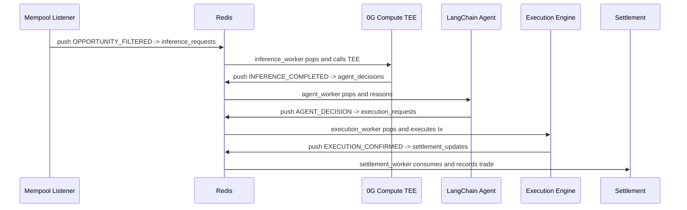

# Pipeline Architecture

This document describes the mempool → TEE → agent → execution → settlement pipeline.

```mermaid
sequenceDiagram
    participant M as Mempool Listener
    participant R as Redis
    participant TEE as 0G Compute TEE
    participant AG as LangChain Agent
    participant EX as Execution Engine
    participant ST as Settlement

    M->>R: push OPPORTUNITY_FILTERED -> inference_requests
    R->>TEE: inference_worker pops and calls TEE
    TEE->>R: push INFERENCE_COMPLETED -> agent_decisions
    R->>AG: agent_worker pops and reasons
    AG->>R: push AGENT_DECISION -> execution_requests
    R->>EX: execution_worker pops and executes tx
    EX->>R: push EXECUTION_CONFIRMED -> settlement_updates
    R->>ST: settlement_worker consumes and records trade
```

See the code in `agent/pipeline` for the implementation.
