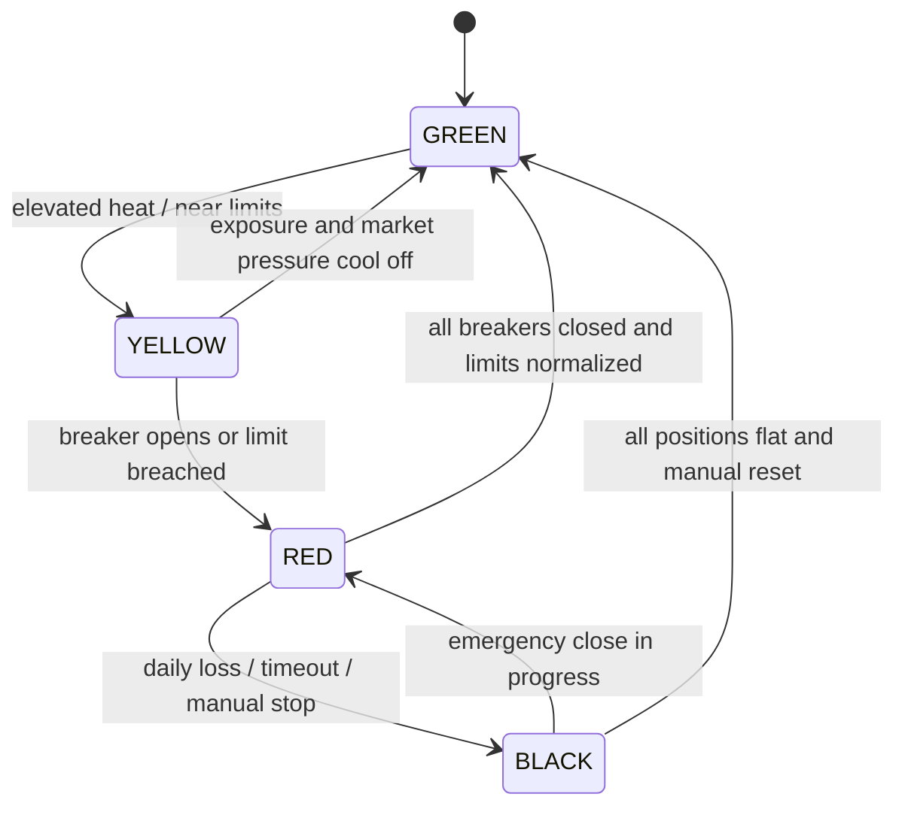

# Risk Management

This module is the central control plane for execution safety. `RiskManager` reads the registry, runs the fastest checks first, and blocks any trade that violates a circuit breaker or portfolio limit.

## Breaker Taxonomy

| Breaker | Trigger | Threshold | Auto Reset | Severity |
| --- | --- | --- | --- | --- |
| `GAS_SPIKE` | Gas rises within the rolling window | `> 30%` in `30s` | `60s` | RED |
| `SLIPPAGE_EXCEEDED` | Realized profit falls below expected | `> 2%` slippage | `300s` | RED |
| `BORROW_RATE_JUMP` | USDC borrow rate accelerates | `> 0.5%` delta | `120s` | RED |
| `MAX_CONCURRENT_POSITIONS` | Too many live trades | `>= 3` open positions | Manual reset on close | YELLOW |
| `DAILY_LOSS_CAP` | Cumulative PnL breaches loss cap | `<= -50 USDT` | Midnight UTC reset | BLACK |
| `MAX_COLLATERAL_RATIO` | Capital is tied up beyond ceiling | `> 2.0x` collateral ratio | Manual reset | RED |
| `POSITION_TIMEOUT` | Trade stays open too long | `>= 30s` | Manual reset | BLACK |
| `INSUFFICIENT_BALANCE` | Flashloan balance proof fails | Any failed proof | Manual reset | RED |
| `HUMAN_OVERRIDE` | Operator types `STOP` | Manual halt | Manual reset | BLACK |

## RiskSnapshot State Machine



`RiskSnapshot` is a point-in-time view of the registry: open breakers, concurrent positions, daily PnL, collateral ratio, gas price, borrow rate, composite heat, and whether trading is currently allowed.

## Gas Spike Timeline

1. The gas monitor records one sample per second.
2. `GasCircuitBreaker.check_spike()` looks at the last 30 seconds.
3. If the current fee is more than 30% above the window baseline, the registry opens `GAS_SPIKE`.
4. New executions stop immediately.
5. If fees normalize to within 10% of the 5-minute average, the breaker closes with `CONDITION_CLEARED`.
6. The event is written to JSONL and SQLite for later review.

Example:

```text
t=00s  baseline = 20.0 gwei
t=18s  current  = 24.0 gwei
t=27s  current  = 27.0 gwei  -> 35% spike, breaker opens
t=87s  fee normalizes near moving average -> breaker closes
```

## Human Override Console Format

Large trades above `10 USDT` pause for operator review and print a 5-second approval window:

```text
============================================================
⚠️  LARGE TRADE PENDING APPROVAL
Opportunity: <opportunity_id>
Expected Profit: $<profit> USDC
Signal: <signal_summary>
Press ENTER to APPROVE or type STOP + ENTER to HALT
Auto-approving in 5 seconds...
============================================================
```

If the operator types `STOP`, the registry opens `HUMAN_OVERRIDE` and the trade is halted.

## For Judges

Every breaker event is also stored in SQLite at `data/circuit_breaker_events.db`. To inspect the full decision trail from a demo session, run:

```sql
SELECT
  event_id,
  breaker_type,
  state_before,
  state_after,
  trigger_value,
  threshold_value,
  opportunity_id,
  triggered_at,
  auto_reset_at,
  resolved_at,
  resolution_method,
  notes
FROM circuit_breaker_events
ORDER BY triggered_at ASC;
```

To see the most active breakers over a time window:

```sql
SELECT breaker_type, COUNT(*) AS trigger_count
FROM circuit_breaker_events
WHERE triggered_at >= strftime('%s', 'now') - 86400
GROUP BY breaker_type
ORDER BY trigger_count DESC;
```
