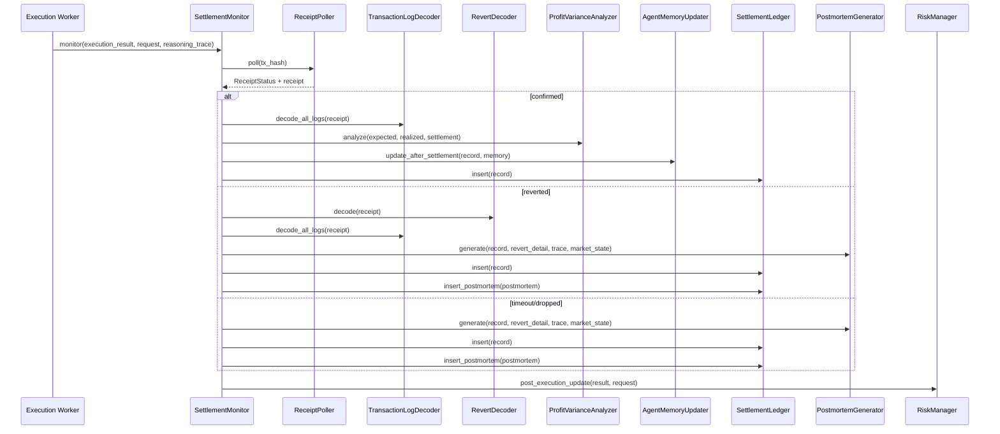

# Settlement Monitor

## Pipeline



## Revert Taxonomy

| Revert reason | Likely root cause | Recommended fix |
| --- | --- | --- |
| `INVALID_SIGNAL_SIGNATURE` | Signed payload does not match the trusted signer or was corrupted in transit | Verify signer key rotation, signature encoding, and payload hash checks |
| `SIGNAL_ALREADY_USED` | The same opportunity was replayed after execution | Enforce single-use opportunity tracking and replay protection |
| `SIGNAL_EXPIRED` | Broadcast happened after the signal deadline | Reduce decision latency and enforce max age before broadcast |
| `PROFIT_BELOW_MINIMUM` | The trade still executed, but realized profit did not clear the threshold | Increase profit buffer and slippage guardrails |
| `INSUFFICIENT_COLLATERAL` | Margin checks were too loose for the borrow size | Raise the minimum collateral ratio |
| `SLIPPAGE_EXCEEDED` | DEX price movement exceeded the configured tolerance | Increase slippage buffer or reduce position size |
| `LENDING_POOL_INSUFFICIENT_LIQUIDITY` | Borrow request exceeded pool availability | Reduce trade size or wait for more liquidity |
| `REPAYMENT_FAILED` | The flashloan principal or fee was not repaid on-chain | Recheck repayment math and token balance assumptions |
| `UNKNOWN_REVERT` | The revert data was not decodable into a known contract error | Capture raw bytes, replay against the prior block, and inspect the transaction path |
| `DECODE_FAILED` | The node did not return a usable revert payload | Retry against a healthy RPC node and confirm the transaction hash |

## Profit Variance Guide

`variance_usdc = realized - expected`

`variance_pct = (variance_usdc / expected) * 100`

Interpretation:

| Range | Meaning | Action |
| --- | --- | --- |
| `abs(variance_pct) <= 1.0` | Accurate | Keep calibration unchanged |
| `variance_pct < -2.0` | Systematically overestimating | Tighten `MIN_PROFIT_MARGIN` |
| `variance_pct > 2.0` | Systematically underestimating | Consider a more aggressive threshold |

The monitor also tags recurring drivers such as gas underestimation, slippage underestimation, and cost overestimation so the team can correct the right part of the model rather than applying a broad penalty.

## Postmortem Example

```json
{
  "postmortem_id": "pm_01",
  "settlement_record_id": "rec_01",
  "opportunity_id": "opp_01",
  "failure_category": "ORACLE_DATA_QUALITY",
  "root_cause": "Stale oracle data caused profit overestimation",
  "contributing_factors": ["Pyth staleness=412ms at execution time"],
  "risk_checks_that_should_have_caught_this": ["MAX_STALENESS_MS guard before broadcast"],
  "recommended_parameter_adjustments": {
    "MAX_STALENESS_MS": "reduce from 500 to 300",
    "MIN_PROFIT_MARGIN_PERCENT": "increase by 0.5%"
  },
  "model_retraining_triggered": true,
  "generated_at": 1710000000000
}
```

Field guide:

`failure_category` identifies whether the issue was a model error, market regime shift, oracle quality problem, or a hard risk-control miss.

`root_cause` is the concise explanation that should be shown in the dashboard and replay reports.

`recommended_parameter_adjustments` is the operational output; these are the exact knobs the team should adjust after the failure.

`model_retraining_triggered` indicates whether the replay database was flagged for the next retraining run.

## For Judges

Run this SQL against `data/flashix.db` to inspect all settlement records sorted by realized profit:

```sql
SELECT
  opportunity_id,
  tx_hash,
  receipt_status,
  COALESCE(realized_profit_usdc, 0) AS realized_profit_usdc,
  COALESCE(gas_cost_usdc, 0) AS gas_cost_usdc,
  COALESCE(profit_variance_pct, 0) AS profit_variance_pct,
  settled_at
FROM settlement_records
ORDER BY COALESCE(realized_profit_usdc, 0) DESC,
         settled_at DESC;
```

Call the ledger summary endpoint with:

```bash
curl http://localhost:8004/ledger/stats
```
